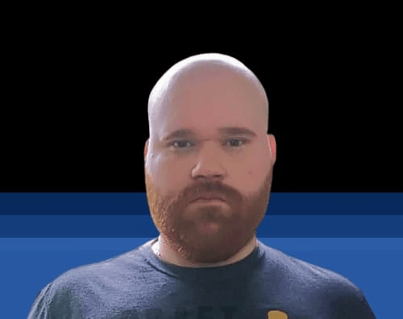

# desafio_tecnico_qa_lucas_oliveira_rodrigues📋📋📋
 

 

 

## 📌 Status do Projeto:

 

 

## 📌 Índice 
* [Título e Imagem de capa](https://github.com/russo1992/desafio_tecnico_qa_lucas_oliveira_rodrigues#desafio_tecnico_qa_lucas_oliveira_rodrigues)
* [Status do Projeto](https://github.com/russo1992/desafio_tecnico_qa_lucas_oliveira_rodrigues#-status-do-projeto)
* [Índice](https://github.com/russo1992/desafio_tecnico_qa_lucas_oliveira_rodrigues#-%C3%ADndice)
* [Descrição do Projeto - Teste Da Solutions](https://github.com/russo1992/desafio_tecnico_qa_lucas_oliveira_rodrigues#-descri%C3%A7%C3%A3o-do-projeto---desafio_tecnico_qa_lucas_oliveira_rodrigues-autenticator-)
* [Pessoa Desenvolvedora do Projeto](https://github.com/russo1992/desafio_tecnico_qa_lucas_oliveira_rodrigues#-pessoa-desenvolvedora-do-projeto)
* [Colaboradores]()
* [Ferramentas utilizadas]()
* [Mapa Mental]()
* [Plano de teste]()
* [Cenario de teste]()
* [Caso de teste]()
* [Relatorio de teste]()
* [Reporter bugs]()
* [Métricas de teste]()
* [Sugestões de melhorias]()
  

 

## 📌 Descrição do Projeto - desafio_tecnico_qa_lucas_oliveira_rodrigues Autenticator :
 

O projeto tem como objetivo implementar uma tela de login com validações necessárias, onde os usuários podem se autenticar, permitindo o acesso a uma plataforma ou sistema.

 

##  📌 Pessoa Desenvolvedora do Projeto:
Prazer em conhecê-lo(a)! Meu nome é Lucas Oliveira, tenho 32 anos e moro na Cidade Maravilhosa, Rio de Janeiro. 
Gmail : lucasrj58@gmail.com   
Linkedin : [Lucas Oliveira Rodrigues](https://www.linkedin.com/in/lucas-oliveira-rodrigues-07bb791b1/).  
 

 

 

## Colaboradores✨
 

* Heinz Stranner Junior (Ele que me falou sobre a vaga).

 

## Ferramentas utilizadas 💻

* Git
* Github
* Xmind
 

